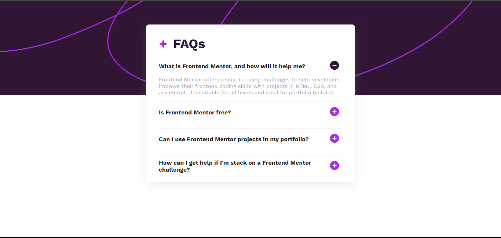
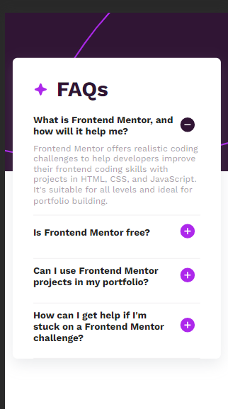

# simple-faq-accordion

## Frontend Mentor - FAQ accordion solution

This is a solution to the [FAQ accordion challenge on Frontend Mentor](https://www.frontendmentor.io/challenges/faq-accordion-wyfFdeBwBz). Frontend Mentor challenges help you improve your coding skills by building realistic projects.

## Table of contents

- [Overview](#overview)
  - [The challenge](#the-challenge)
  - [Screenshot](#screenshot)
  - [Links](#links)
- [My process](#my-process)
  - [Built with](#built-with)
- [Author](#author)

## Overview

### The challenge

Users should be able to:

- Hide/Show the answer to a question when the question is clicked
- Navigate the questions and hide/show answers using keyboard navigation alone
- View the optimal layout for the interface depending on their device's screen size
- See hover and focus states for all interactive elements on the page

### Screenshot

### Links

- Solution URL: [solution ](https://www.frontendmentor.io/solutions/simple-faq-accordion-ui-eMuG8jXwQW)
- Live Site URL: [website live](https://simple-faq-accordion.netlify.app/)

## My process

- creation of the github repository
- clone the repository on my computer
- creation of files and structuring of the project
- integration of the model with HTML5
- added CSS
- add Javascripts for interaction with the arrow button
- sending modifications to the remote repository by pushing

### Built with

- Semantic HTML5 markup
- CSS custom properties
- Flexbox
- CSS Grid
- JS
- SASS
- Mobile-first workflow

## Author

- Frontend Mentor - [@Bope142](https://www.frontendmentor.io/profile/Bope142)
